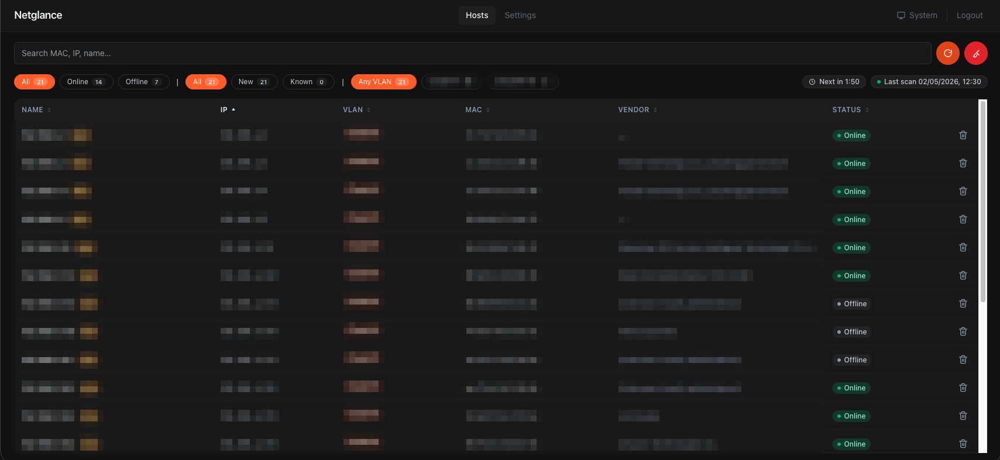
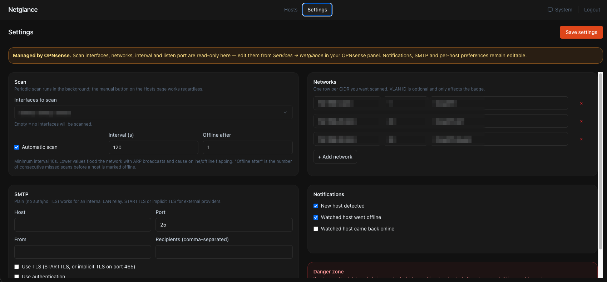
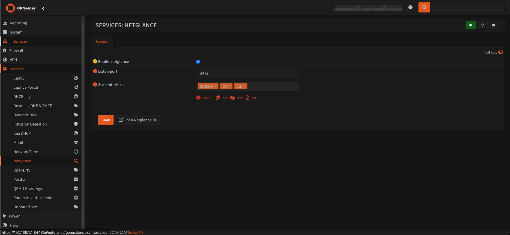

# Netglance

[](https://github.com/netglance/netglance/actions/workflows/build.yml)
[](https://github.com/netglance/netglance/releases)
[](LICENSE)

> ⚠️ **Early development.** Netglance is under active development —
> the OPNsense plugin in particular has not been hardened on a wide
> range of hosts yet. Expect rough edges, breaking config changes
> between minor versions, and don't deploy on a production firewall
> you can't recover from a snapshot. Bug reports very welcome.

> 🧪 **Vibe-coded.** Netglance was built largely through vibe coding
> with an LLM in the loop — designed and shipped quickly, not yet
> code-reviewed by humans line by line. Treat the codebase
> accordingly: read before you trust, especially anything that runs
> on a firewall.

**Discover, inventory and watch every device on your LAN.** Netglance scans
configured CIDRs over ARP, keeps a SQLite history of when each MAC was
first/last seen and on which IP, and ships a mobile-friendly web UI on
its own port. Per-VLAN aware, lightweight (single Go binary, ~30 MB), and
designed to run on the firewall itself — most users install it as an
**OPNsense plugin** that adds a `Services → Netglance` tab.

| Hosts page | Settings page |
|---|---|
|  |  |

| OPNsense plugin |
|---|
|  |

## Features

- 🔍 **ARP-based discovery** (`arp-scan`) — fast, cheap, no agents
- 🏷️ **Multi-VLAN data model** — tag devices by VLAN, scan multiple subnets
- 📈 **Online/offline history** — per-host event timeline + uptime chart
- 🔔 **Email notifications** (SMTP plain / STARTTLS / SMTPS) on new device,
   offline, back-online
- ⏱️ Configurable auto-scan + manual trigger
- 📱 **Mobile-first PWA**, installable on iOS/Android
- 🌓 Light / dark / system theme
- 🔐 Local admin login, HttpOnly session cookie, proxy-aware
- ⚙️ Three install paths: **OPNsense plugin**, native Linux/FreeBSD, Docker

## Install

| Target | Guide |
|---|---|
| **OPNsense plugin** *(recommended for OPNsense users)* | [docs/install/opnsense-plugin.md](docs/install/opnsense-plugin.md) |
| Linux native (systemd) | [docs/install/linux-native.md](docs/install/linux-native.md) |
| FreeBSD native | [docs/install/freebsd-native.md](docs/install/freebsd-native.md) |
| Docker | [docs/install/docker.md](docs/install/docker.md) |

### OPNsense in 4 commands

```sh
ssh root@<opnsense>
fetch -o /usr/local/etc/pkg/keys/netglance.pub  https://netglance.github.io/netglance/netglance.pub
fetch -o /usr/local/etc/pkg/repos/netglance.conf https://netglance.github.io/netglance/netglance.conf
pkg update && pkg install -y os-netglance
```

> Verify the pubkey before trusting it — see [Package signing key](#package-signing-key) below.

Then go to **Services → Netglance** in your OPNsense GUI, enable the plugin,
pick interfaces, save. Done. The web UI opens on port 8473.

> ⚠️ **Public release status**: the OPNsense plugin path requires the
> repo's `gh-pages` branch to be live with a current build. See
> [docs/install/opnsense-plugin.md](docs/install/opnsense-plugin.md) for
> the full setup including signature verification.

### Docker in 30 seconds

```sh
git clone https://github.com/netglance/netglance && cd netglance
docker compose up -d
```

UI on `http://localhost:8473`. Note: `arp-scan` needs `network_mode: host`,
which doesn't fully work on Docker Desktop (macOS/Windows) — for real LAN
scanning use a Linux host or one of the native install paths.

## How it compares

| | netglance | [WatchYourLAN](https://github.com/aceberg/WatchYourLAN) | [NetAlertX](https://github.com/jokob-sk/NetAlertX) | [Pi.Alert](https://github.com/leiweibau/Pi.Alert) |
|---|:---:|:---:|:---:|:---:|
| ARP-based discovery | ✅ | ✅ | ✅ | ✅ |
| Native OPNsense plugin | ✅ | ❌ | ❌ | ❌ |
| Multi-VLAN, per-device tags | ✅ | partial | ✅ | partial |
| Mobile-first PWA | ✅ | ❌ | ❌ | ❌ |
| Single binary install | ✅ | ✅ | ❌ (PHP+Python+nginx) | ❌ (PHP) |
| Email notifications | ✅ | ❌ | ✅ | ✅ |

Netglance is closest in spirit to WatchYourLAN — same minimalism — but
adds the OPNsense integration, a richer per-host history view and a UI
designed to be useful on a phone.

## Configuration

When installed as an OPNsense plugin, the listen port, scan interfaces,
networks (CIDR + VLAN) and scan interval are managed from
**Services → Netglance** and stored in OPNsense's `config.xml`. The rest
(SMTP, notification toggles, per-host names/notes/watch-flags, admin
password) lives inside netglance and is configured from the web UI.

In the other install modes, **everything** lives inside netglance and is
configured from a first-run wizard.

## Package signing key

The FreeBSD pkg repo published at `https://netglance.github.io/netglance/`
is signed with an RSA-4096 keypair generated for v1.0.0. Verify the
public key fingerprint after fetching it, in case GitHub Pages itself
were ever compromised:

```
SHA256 (DER): 479df3c427e8fd354e5a88839d80fdbc102cfea882dbbca9bfd69f2e2583bfa4
```

Compute locally to compare:

```sh
openssl rsa -in /usr/local/etc/pkg/keys/netglance.pub -pubin -outform DER \
  | sha256sum
```

If the two strings don't match, **do not** run `pkg install` — open an issue.

## Reverse proxy

```caddyfile
netglance.example.com {
    reverse_proxy <netglance-host>:8473
}
```

Netglance honors `X-Forwarded-Proto: https` and flips the session cookie's
`Secure` flag accordingly.

## Local development

```sh
make local         # full app in Docker on http://localhost:8473
make ui            # frontend HMR (proxies /api to a running backend)
make build         # static binary ./netglance (frontend embedded)
make help          # full target list
```

For OPNsense plugin development (PHP/Volt/configd), you need an OPNsense VM —
see [dev/opnsense-vm/README.md](dev/opnsense-vm/README.md).

> **macOS Docker note**: the container only sees Docker Desktop's internal
> network. UI, settings, auth, migrations, vendor lookup and the scan loop
> are all testable; real LAN/VLAN scanning needs a Linux host or a VM.

## Contributing

Issues and pull requests welcome — see [CONTRIBUTING.md](CONTRIBUTING.md).
For security disclosures see [SECURITY.md](SECURITY.md).

## License

MIT — see [LICENSE](LICENSE).
